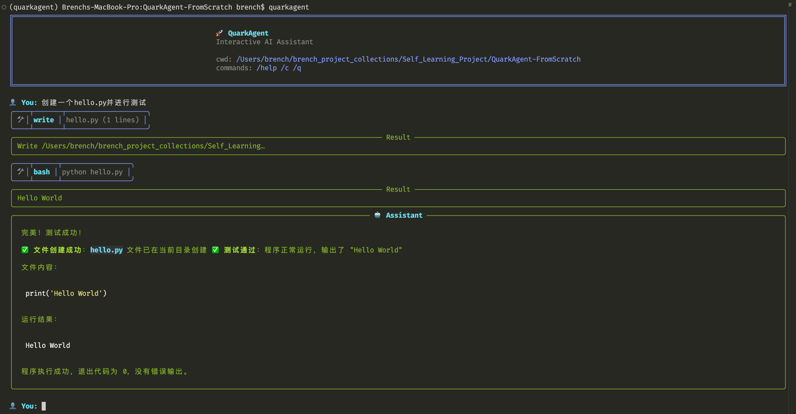
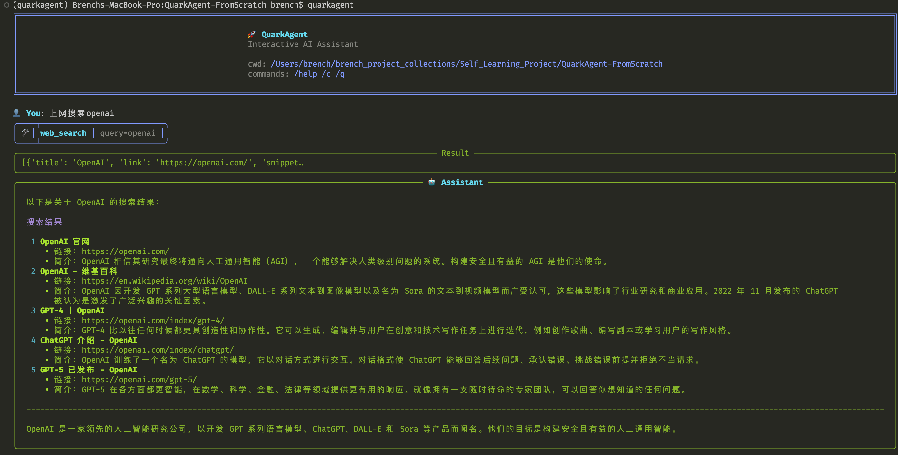
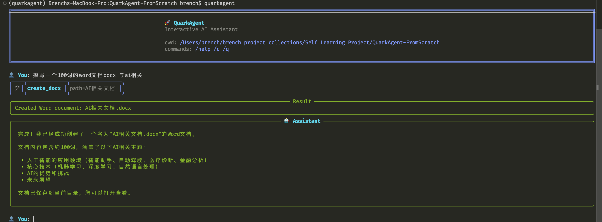
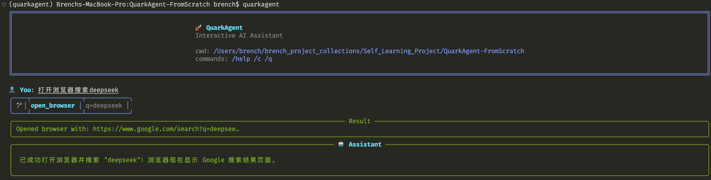

# QuarkAgent

🚀 **轻量级 AI 编程助手（CLI + Web）从0到1构建！**

<div align="center">
  
</div>

## 💡 核心特性

**极简、高效、透明的 Agent 框架**，专为 AI 编程助手设计：

- 🧠 **智能编程助手**: 像 Claude Code 一样写代码、修复 Bug、运行测试
- ⚡ **轻量级实现**: 核心逻辑 (`agent.py`) 简洁高效，完全透明可控
- 🤖 **多模型支持**: 完美支持 OpenAI、Claude、DeepSeek 等所有兼容 OpenAI 接口的模型
- 🔌 **高度可扩展**: 极简的装饰器模式，轻松挂载自定义工具
- 📚 **内置丰富工具**: 提供代码操作、文件管理、系统命令等常用工具
- 💾 **会话记忆**: 支持会话记忆功能，保持上下文连贯性
- 🎯 **命令行界面**: 简洁易用的 CLI，快速启动和交互
- 🌐 **Web 聊天界面**: 新增 `frontend` + `FastAPI` 后端，支持 REST + SSE 实时事件流

## 快速开始

### 安装

```bash
git clone https://github.com/BrenchCC/QuarkAgent-FromScratch.git
cd QuarkAgent-FromScratch
pip install -r requirements.txt
pip install -e .  # 安装 quarkagent 命令
```

### 配置

创建 `.env` 文件：

```bash
LLM_API_KEY=your_api_key_here
LLM_MODEL=gpt-4o
LLM_API_BASE=https://api.openai.com/v1
```

### 运行

```bash
quarkagent          # 或 python -m quarkagent
```

## Web 模式（Frontend + FastAPI）

### 一条命令同时启动前后端（推荐）

```bash
bash scripts/dev-web.sh
```

可选参数（环境变量）：

```bash
CONDA_ENV=quarkagent BACKEND_PORT=8000 FRONTEND_PORT=5173 bash scripts/dev-web.sh
```

使用 venv 启动后端：

```bash
PY_ENV_MODE=venv VENV_PATH=.venv bash scripts/dev-web.sh
```

自动选择 Python 环境（优先 conda，其次 venv）：

```bash
PY_ENV_MODE=auto CONDA_ENV=quarkagent VENV_PATH=.venv bash scripts/dev-web.sh
```

如需自动使用本地代理（127.0.0.1:1088）：

```bash
USE_LOCAL_PROXY=1 bash scripts/dev-web.sh
```

### 1. 启动后端

```bash
uvicorn app.main:app --reload
```

默认地址：`http://127.0.0.1:8000`  
OpenAPI 文档：`http://127.0.0.1:8000/docs`

### 2. 启动前端

```bash
cd frontend
npm install
npm run dev
```

默认地址：`http://127.0.0.1:5173`

前端可选环境变量（`frontend/.env.local`）：

```bash
VITE_API_BASE_URL=http://127.0.0.1:8000
```

### 3. Web API 列表

- `GET /api/health`
- `POST /api/sessions`
- `DELETE /api/sessions/{session_id}`
- `GET /api/tools`
- `POST /api/chat`（同步）
- `POST /api/chat/stream`（SSE）

SSE 事件类型：
- `status`
- `tool_start`
- `tool_end`
- `final`
- `error`
- `done`

前端接口文档：`frontend/docs/api-integration.md`

## 使用示例

```
you: 帮我创建一个 hello.py 文件
  ● write hello.py (1 lines)
    → ok
🤖 已创建 hello.py 文件！

you: 运行一下
  ● bash python hello.py
    → Hello World!
🤖 运行成功！
```

## ⚡ 演示

### 1. 代码生成与调试
> Prompt: "创建一个 hello.py并测试"



### 2. 自动化网页搜索
> Prompt: "上网搜索openai"



### 3. 文档创建与编辑
> Prompt: "撰写一个100词的word docx，与ai相关"



### 4. 浏览器自动化
> Prompt: "打开浏览器搜索deepseek"



## 内置工具

| 类别 | 工具 | 描述 |
|---|---|---|
| **代码操作** | `read` | 读取文件内容 |
| | `write` | 创建/覆盖文件 |
| | `edit` | 编辑文件指定行 |
| | `grep` | 搜索文件内容 |
| | `glob` | 列出匹配的文件 |
| | `bash` | 执行 Shell 命令 |
| **系统控制** | `open_browser` | 打开网页或搜索 |
| | `open_app` | 启动本地应用 |
| | `create_docx` | 创建 Word 文档 |
| | `clipboard_copy`| 复制到剪贴板 |
| **实用工具** | `calculator` | 数学计算 |

## 项目结构

```
app/                  # FastAPI Web 后端
├── main.py
├── settings.py
├── schemas.py
├── session_manager.py
├── agent_service.py
└── routes/
    ├── chat.py
    └── system.py
frontend/             # React + TypeScript Web 前端
├── src/
│   ├── components/
│   ├── hooks/
│   ├── lib/
│   ├── styles/
│   └── types/
└── docs/
    └── api-integration.md
quarkagent/
├── agent.py          # 核心 Agent 类
├── cli.py            # 命令行界面
├── config.py         # 配置管理
├── tools/            # 工具集
│   ├── code_tools.py   # 代码操作工具
│   └── basic_tools.py  # 基础工具
├── utils/            # 工具函数
├── prompts/          # 提示模板
└── examples/         # 使用示例
```

## 测试

后端 Web API 测试：

```bash
python examples/test_web_api.py
```

前端构建与静态检查：

```bash
cd frontend
npm run lint
npm run build
```

## 自定义工具

```python
from quarkagent import QuarkAgent
from quarkagent.tools import register_tool

@register_tool
def my_tool(arg: str) -> str:
    """我的自定义工具"""
    return f"处理: {arg}"

agent = QuarkAgent(...)
agent.load_builtin_tool("my_tool")
```

## 致谢

QuarkAgent 的设计思路参考了优秀的 AI Agent 项目，感谢开源社区的贡献！

**Reference**: 
- [MiniAgent](https://github.com/ZhuLinsen/MiniAgent) 
- [nanocode](https://github.com/1rgs/nanocode)
## 许可证

[MIT License](LICENSE)

---

⭐ 如果这个项目对你有帮助，请给个 Star！
